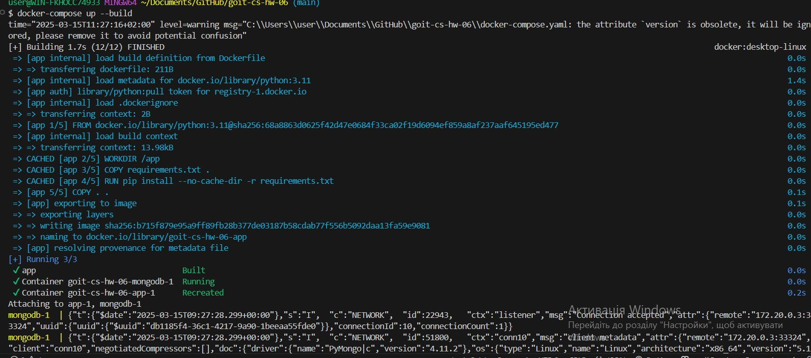
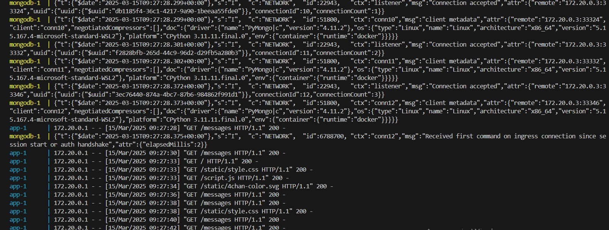
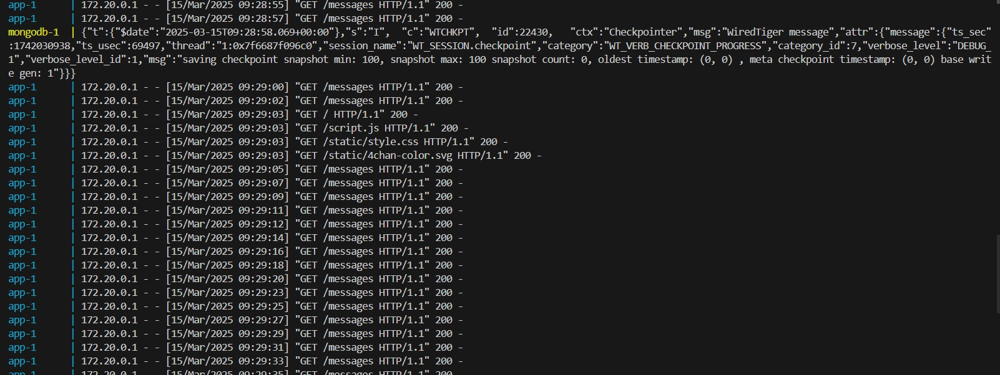
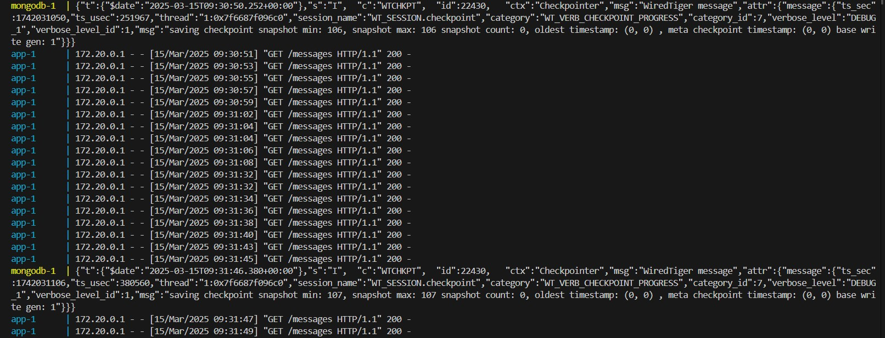
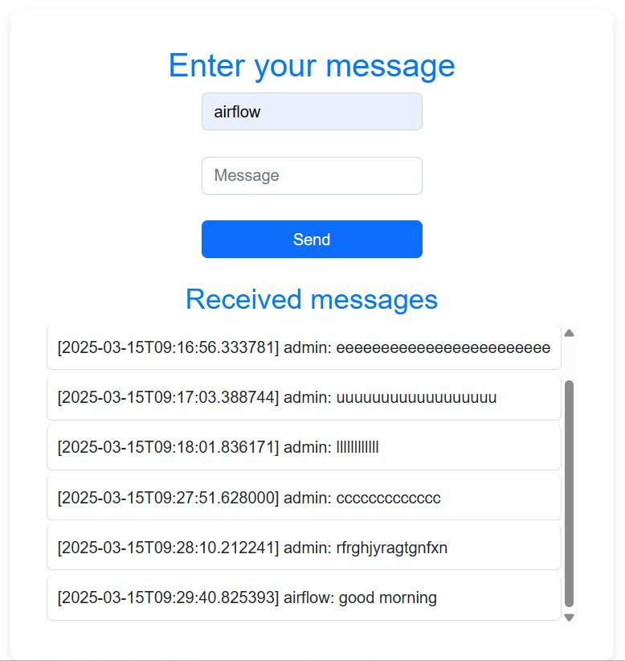
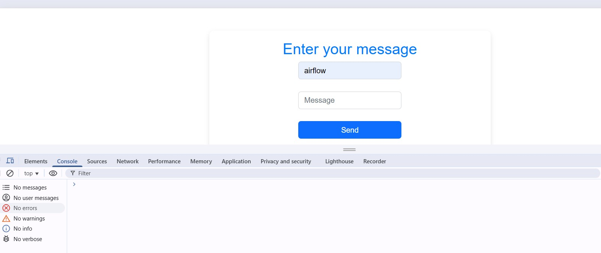

# goit-cs-hw-06

Запуск

Запустити сервери:

docker-compose up --build

Відкрити браузер на http://localhost:3000 та відправляти повідомлення.

Скріншот запуску

Скріншоти роботи в терміналі

Скріншот index.html

Скріншот консолі помилок немає

